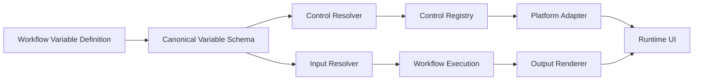

# Workflow 变量驱动 UI 架构

## 1. 目标

Workflow 只描述它需要什么数据、数据具有什么语义，以及运行后产生什么结果。桌面端、Web 端或未来的移动端根据同一份变量契约决定输入控件、校验方式和结果呈现。



这条链路的关键约束是：Workflow 不知道控件如何实现，页面不需要知道节点如何产生变量。

## 2. 术语

### Variable Contract（变量契约）

发布版本对调用方公开的输入和输出描述。契约是运行时 UI、校验器和调用方之间的唯一约定。

### Primitive Type（基础类型）

数据在运行时的结构类型：`string`、`number`、`integer`、`boolean`、`object`、`array`。

### Semantic Type（语义类型）

数据在业务上的含义：`text`、`file`、`file_path`、`directory`、`device`、`device_list`、`image`、`enum`、`date`、`time`、`url`、`json`。

基础类型决定值如何传输和校验，语义类型决定用户如何获取或理解这个值。`file` 和 `device` 不应继续作为基础类型的特殊分支。

### Variable Scope（变量作用域）

- `input`：调用 Workflow 时由用户或上游 Workflow 提供。
- `context`：运行时自动提供，例如当前设备、会话、用户和环境信息。
- `internal`：节点之间传递的中间变量，不显示在运行参数表单中。
- `output`：发布版本承诺给调用方的结果。

### Control Descriptor（控件描述）

Control Resolver 根据变量契约生成的 UI 无关描述，例如 `file-picker`、`device-picker` 或 `select` 及其属性。它不包含 Vue、Electron 或浏览器 API。

### Platform Adapter（平台适配器）

将控件描述连接到具体平台能力的 Adapter。例如桌面端文件选择器、Web 浏览器文件选择器和移动端相册选择器都实现文件选择能力，但返回值必须符合同一个变量契约。

### Output Renderer（输出渲染器）

根据输出契约将运行结果呈现为文本、JSON、表格、下载项、设备摘要或隐藏值的渲染模块。

## 3. 规范变量 Schema

Workflow 文档中的变量采用以下结构。字段使用 camelCase，是跨语言和导出格式的稳定契约；后端内部可以保留 snake_case 映射。

```json
{
  "name": "input_file",
  "primitiveType": "string",
  "semanticType": "file",
  "scope": "input",
  "required": true,
  "multiple": false,
  "default": null,
  "constraints": {
    "accept": [".pdf", ".docx"],
    "maxSizeBytes": 104857600
  },
  "uiHints": {
    "label": "上传文件",
    "help": "支持 PDF 和 DOCX",
    "placeholder": "选择本地文件"
  }
}
```

输出变量使用相同的基础字段，并增加呈现信息：

```json
{
  "name": "report",
  "primitiveType": "string",
  "semanticType": "file",
  "scope": "output",
  "value": "${build.report}",
  "presentation": "download",
  "mimeType": "text/plain",
  "downloadName": "report.txt"
}
```

### Schema 不变量

1. `name` 在同一 Workflow 作用域内唯一，并符合变量引用语法。
2. `scope=input` 的变量必须能够被调用方提供，`scope=internal` 不生成运行参数控件。
3. `primitiveType` 决定序列化和最终值校验；`semanticType` 不改变值的基础结构。
4. `multiple=true` 时，值统一为数组，即使用户只选择了一个项目。
5. `default` 必须符合基础类型和约束；默认值不能绕过 `required` 的语义。
6. 文件输入在执行前解析为本地来源引用，暂存和传输由后端负责，设备目标路径是另一个变量。
7. 输出的 `value` 只能是常量或完整变量引用，避免把不明确的字符串插值当成结构化结果。

## 4. 模块和 Seam

### 4.1 Variable Contract Module

这是对外最深的模块。调用方只需要提交变量定义和值，模块负责标准化、默认值、类型转换、约束校验和引用解析。

建议接口：

```python
normalize_definition(raw) -> VariableDefinition
resolve_inputs(definitions, supplied) -> ResolvedInputs
resolve_reference(value, context, *, strict=True) -> Any
validate_outputs(definitions, values) -> tuple[ContractIssue, ...]
```

现有 `WorkflowInput`、`WorkflowOutput` 和 `workflow_studio.contract` 是迁移起点。当前的 `type` 字段需要兼容读取，但新文档应逐步使用 `primitiveType` 和 `semanticType`。

### 4.2 Control Registry

Control Registry 是可注册的控件能力目录，不属于某个页面。

```python
class ControlDefinition(Protocol):
    id: str
    semantic_types: frozenset[str]
    primitive_types: frozenset[str]

    def supports(self, variable: VariableDefinition) -> bool: ...
    def describe(self, variable: VariableDefinition) -> ControlDescriptor: ...
```

初始注册项：

| 控件 | 语义 | 主要约束 |
| --- | --- | --- |
| `text-input` | text | 长度、正则、默认值 |
| `text-area` | text / json | 最大长度、格式 |
| `file-picker` | file | accept、大小、单选/多选 |
| `directory-picker` | directory | 是否允许多目录 |
| `device-picker` | device | 能力、在线状态、来源 |
| `device-list-picker` | device_list | 批量选择、过滤条件 |
| `select` | enum | options、默认值 |
| `switch` | boolean | 默认值 |
| `date-picker` | date | 范围、时区 |
| `json-editor` | json | Schema、格式校验 |

解析优先级：显式 `uiHints.control` > `semanticType` > `primitiveType` > 默认文本控件。显式控件如果不满足类型约束必须报契约错误，不能静默降级。

### 4.3 Platform Adapter

Control Resolver 只返回平台无关的 `ControlDescriptor`。平台 Adapter 提供实际能力：

```typescript
interface PlatformControlAdapter {
  supports(control: string): boolean
  openFilePicker(options: FilePickerOptions): Promise<FileReference[]>
  listDevices(query: DeviceQuery): Promise<DeviceOption[]>
}
```

Electron 的文件和目录选择必须继续通过 preload/IPC，不能让 Renderer 直接执行特权文件操作。设备选择器只返回设备 ID 和显示摘要，不返回凭据。

### 4.4 Runtime Input Resolver

运行时顺序固定为：

```text
读取发布版本
  -> 合并调用参数与默认值
  -> 解析基础类型
  -> 校验 semanticType 约束
  -> 解析文件暂存/设备引用
  -> 建立 execution context
  -> 编译并执行 Workflow
```

输入校验失败时不能创建 Task，也不能暂存文件。高风险确认同样必须发生在文件暂存前。

### 4.5 Output Renderer

输出渲染只接收 `OutputDefinition` 和已解析值，不读取节点类型。渲染器至少支持：

- `text`：纯文本和复制
- `json`：结构化折叠查看
- `table`：数组对象的列式查看
- `download`：文件引用、MIME 和下载名称
- `device`：设备摘要
- `hidden`：供上游 Workflow 使用，不显示给用户

## 5. 变量引用规则

统一使用 `${path.to.value}`：

- 完整引用 `${inputs.count}` 返回原始数字、对象或数组。
- 文本插值 `count=${inputs.count}` 返回字符串。
- 严格模式下未知引用是错误；预览模式可显示未解析状态。
- `internal` 变量只在其定义节点之后可见，禁止前向引用。
- 输出引用必须经过输出 Schema 校验，避免把任意节点内部字段误发布为公共接口。

## 6. 发布版本的公共响应

发布目录不只返回旧的 `inputs`/`outputs`，还返回标准化契约：

```json
{
  "id": "workflow_upgrade",
  "version": 3,
  "inputContract": [],
  "outputContract": [],
  "requiresConfirmation": true
}
```

旧字段在迁移期间保留。客户端优先读取 `inputContract` 和 `outputContract`，读取不到时再转换旧格式。

## 7. 与当前代码的迁移方案

### 阶段一：兼容层

- 保留 `WorkflowInput.type` 和现有 YAML/JSON 格式。
- 在读取时将旧类型转换为 `primitiveType + semanticType`。
- 继续输出旧 `inputs`/`outputs`，同时输出标准契约。
- 将现有 `workflow_studio.contract` 作为唯一的输入转换和引用解析入口。

### 阶段二：解析器集中化

- 新建 Control Registry 和 Output Renderer Registry。
- 将 `WorkflowRunDialog.vue`、`WorkflowSettingsPanel.vue` 中按类型分支迁移到契约驱动渲染。
- 后端返回 `ControlDescriptor`，前端只负责通用渲染和平台调用。

### 阶段三：平台能力适配

- 抽取 Electron 文件/目录选择 Adapter。
- 抽取设备目录查询 Adapter。
- 为 Web 和 Mobile 保留相同的契约，替换平台实现。

### 阶段四：输出与插件扩展

- 输出结果全部经过 Output Renderer Registry。
- 插件可以注册新的 semantic type、control 和 renderer，但不能修改基础类型和引用规则。

## 8. 关键测试

必须测试以下契约，而不是只测试某个 Vue 页面：

1. 旧格式能转换为新 Schema，并可再次导出。
2. 文件、目录、设备、设备列表都生成正确的控件描述。
3. 表单字符串能按基础类型转换，错误包含变量名和约束。
4. 多选输入始终返回数组。
5. 完整引用保留原类型，文本插值返回字符串。
6. 未知引用、前向引用和错误输出类型在发布前被拒绝。
7. 不同平台 Adapter 对同一契约返回相同的领域值结构。
8. 输出渲染器不依赖 Workflow 节点类型。

## 9. 非目标

- 不把 UI 布局、颜色、CSS 类名写入 Workflow Schema。
- 不让 Workflow 直接调用 Electron、浏览器或移动端 API。
- 不把凭据、Cookie 或原始设备连接对象作为变量值。
- 不为每种设备厂商复制一套变量和控件体系；厂商差异应留在设备能力和 Adapter 层。
